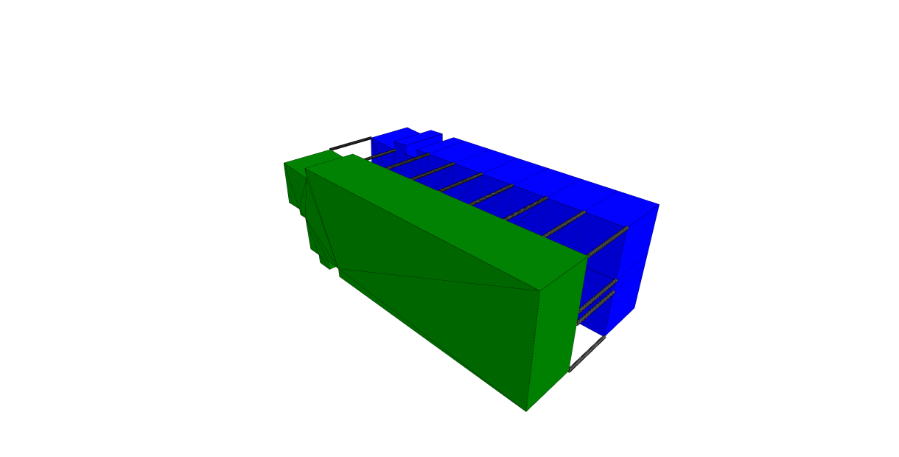

# Assignment 03 Report

## Building Graph Representation and Node Classification

**Course:** Graph Machine Learning  
**Assignment:** Assignment 03, Building Graph Representation  
**Date:** 8 June 2026

## Abstract

This assignment converts a Rhino-exported architectural model into a Building
Graph Representation (BGR) and uses it for graph machine learning. Four OBJ
files represent the main semantic layers of the building: ground slab,
columns, office volumes, and core. These parts are imported into TopologicPy,
converted into topological cells, labelled with semantic dictionaries, merged
into a `CellComplex`, and transformed into an adjacency graph. The exported
BGR contains one graph, 55 nodes, and 286 directed edge records. Because graph
classification requires many building graphs, the single exported building is
instead used for node classification. A node-classification dataset is derived
from the BGR, mapping the original cell types to contiguous labels and using
normalised node coordinates as features. The resulting model demonstrates the
complete workflow from geometry to graph dataset, training, evaluation, and
model export.

## 1. Introduction

Architectural geometry contains both shape and relationship. A building can be
modelled as a set of volumes, but it can also be represented as a graph whose
nodes describe spatial or construction elements and whose edges describe
adjacency. This graph representation makes the model suitable for graph
machine learning.

The aim of this assignment is to:

1. Import a layered Rhino OBJ model into TopologicPy.
2. Assign semantic categories to each building component.
3. Build a merged topological model and convert it into a graph.
4. Export the graph as CSV files.
5. Train a graph machine learning workflow on the exported data.

The initial assignment notebook was graph-classification oriented. However,
only one building graph was exported. Since graph classification requires
multiple labelled graphs, this work adapts the dataset into a node
classification task using the 55 nodes inside the generated BGR graph.

## 2. Input Data

The building model is stored in `assignment03/obj` as four OBJ files:

| File | Role | Size |
|---|---|---:|
| `ground.obj` | Ground slab or podium | 10,528 bytes |
| `columns.obj` | Structural columns | 659,842 bytes |
| `offices.obj` | Office volumes | 50,879 bytes |
| `core.obj` | Core and circulation volume | 2,225 bytes |

Each OBJ layer is imported separately. This preserves the semantic distinction
between building parts before they are merged into one topological model.



*Figure 1. Coloured TopologicPy model exported as `topology.png`.*

## 3. Methodology

### 3.1 OBJ Import

The BGR creation notebook is:

`classfications/S06-13A GML Creating BGR Graph - dan.ipynb`

The setup cell locates the OBJ folder automatically using candidate paths, so
the notebook can run from the repository root or from the notebook directory.
The OBJ files are imported with `Topology.ByOBJPath`:

```python
ground_objs = Topology.ByOBJPath(str(SUPPORT_DIR / "ground.obj"), transposeAxes=False)
column_objs = Topology.ByOBJPath(str(SUPPORT_DIR / "columns.obj"), transposeAxes=False)
office_objs = Topology.ByOBJPath(str(SUPPORT_DIR / "offices.obj"), transposeAxes=False)
core_objs = Topology.ByOBJPath(str(SUPPORT_DIR / "core.obj"), transposeAxes=False)
```

### 3.2 Semantic Cell Creation

For each imported object group, faces are extracted, flattened, self-merged,
and converted into cells. Each cell receives a dictionary containing:

- `cell_type`
- `cell_name`
- `cell_color`

The category mapping is:

| Original cell type | Name | Colour |
|---:|---|---|
| 0 | ground | green |
| 1 | column | gray |
| 3 | office | blue |
| 4 | core | red |

The resulting cell counts are:

| Category | Cells |
|---|---:|
| Ground | 1 |
| Column | 36 |
| Office | 17 |
| Core | 1 |
| **Total** | **55** |

### 3.3 CellComplex and Dictionary Transfer

The cells are merged into one `CellComplex`:

```python
model = Topology.SelfMerge(Cluster.ByTopologies(all_cells))
```

Dictionaries are transferred from internal selector vertices back to the cells:

```python
model = Topology.TransferDictionariesBySelectors(
    model,
    selectors,
    tranCells=True,
)
```

This step is important because the later graph vertices inherit semantic
information from the cells.

### 3.4 Graph Construction and Feature Engineering

The adjacency graph is created from the merged topology:

```python
graph = Graph.ByTopology(model)
vertices = Graph.Vertices(graph)
```

Each vertex receives a one-hot encoding of its `cell_type`:

| Feature | Meaning |
|---|---|
| `feature_00` | ground |
| `feature_01` | column |
| `feature_02` | plinth / unused class |
| `feature_03` | office |
| `feature_04` | core |

The graph is exported to CSV using `Graph.ExportToCSV`.

## 4. Exported BGR Dataset

The initial BGR dataset is stored in:

`assignment03/bgr_dataset`

It contains:

| File | Rows | Description |
|---|---:|---|
| `graphs.csv` | 1 | One building graph |
| `nodes.csv` | 55 | Graph nodes derived from cells |
| `edges.csv` | 286 | Directed adjacency edge records |
| `meta.yaml` | - | Dataset metadata |

The single row in `graphs.csv` is:

```csv
graph_id,label
0,0
```

This confirms that the export succeeded, but it also shows why graph
classification is not appropriate for this dataset: there is only one graph
sample and only one graph label.

## 5. Node Classification Dataset

To create a valid machine-learning task from the available data, a second
dataset is generated:

`assignment03/bgr_node_dataset`

The notebook used for this task is:

`classfications/S06-13 Node Classification - DAN.ipynb`

The original BGR export stores node category information as one-hot features.
For node classification, those one-hot values are converted back into labels.
The labels must be contiguous integers for PyTorch, so the original cell types
are remapped as follows:

| Original cell type | Training label | Name |
|---:|---:|---|
| 0 | 0 | ground |
| 1 | 1 | column |
| 3 | 2 | office |
| 4 | 3 | core |

The final node label distribution is:

| Label | Name | Nodes |
|---:|---|---:|
| 0 | ground | 1 |
| 1 | column | 36 |
| 2 | office | 17 |
| 3 | core | 1 |
| **Total** |  | **55** |

The one-hot category columns are removed from the input features to avoid
leaking the answer into the model. The model instead uses normalised node
coordinates:

- `feat_x`
- `feat_y`
- `feat_z`

The graph edges still provide neighbourhood information for GraphSAGE.

The split masks are:

| Split | Nodes |
|---|---:|
| Training | 39 |
| Validation | 8 |
| Testing | 8 |

Rare classes represented by only one node are kept in training because they
cannot be meaningfully split across training, validation, and testing.

## 6. Model Training

The node classification model uses TopologicPy's PyG interface with a
GraphSAGE convolutional architecture. The main settings are:

| Setting | Value |
|---|---|
| Prediction level | node |
| Task | classification |
| Convolution | GraphSAGE |
| Hidden dimensions | `(64, 64)` |
| Activation | ReLU |
| Dropout | 0.20 |
| Optimiser | AdamW |
| Learning rate | 0.001 |
| Epochs | 100 |

The trained model is saved as:

`assignment03/bgr_node_model.pt`

The verified run completed 100 epochs and produced:

| Metric | Value |
|---|---:|
| Final training loss | 0.0543 |
| Final validation loss | 0.0913 |
| Validation accuracy | 1.0000 |
| Test accuracy | 1.0000 |

These metrics should be interpreted carefully. The dataset is very small and
imbalanced, and the validation and test masks cannot contain the rare ground
and core classes. Therefore, the result demonstrates a working pipeline rather
than a generalisable classifier.

## 7. Discussion

The BGR workflow was successful. The assignment produced a valid topological
model, transferred semantic categories to cells, generated an adjacency graph,
and exported the dataset to CSV. The key modelling issue was not export
failure, but task selection. A single building graph cannot train a graph-level
classifier because graph classification learns from differences between many
graphs. The available data is more naturally suited to node classification,
because the single graph contains 55 labelled elements.

The node classification workflow demonstrates how graph machine learning can
be applied even when only one building is available. Each node represents a
semantic building component, and the graph structure describes adjacency
between components. However, a more robust experiment would require either:

- more buildings for graph classification, or
- more labelled nodes and more balanced categories for node classification.

## 8. Conclusion

This assignment converts layered architectural OBJ geometry into a Building
Graph Representation and uses it for graph machine learning. The generated BGR
contains one graph, 55 nodes, and 286 directed edge records. Since only one
graph is available, the workflow is adapted from graph classification to node
classification. A second dataset is generated with corrected node labels and
normalised coordinate features, and a GraphSAGE model is trained and saved.

The final deliverables demonstrate the complete pipeline:

1. Rhino OBJ geometry import.
2. Semantic cell labelling.
3. TopologicPy CellComplex creation.
4. BGR graph export.
5. Node classification dataset preparation.
6. GraphSAGE training and evaluation.

The work confirms that the BGR representation is suitable for machine learning
preparation, while also showing that the choice between graph classification
and node classification depends directly on the number and structure of the
available graph samples.

